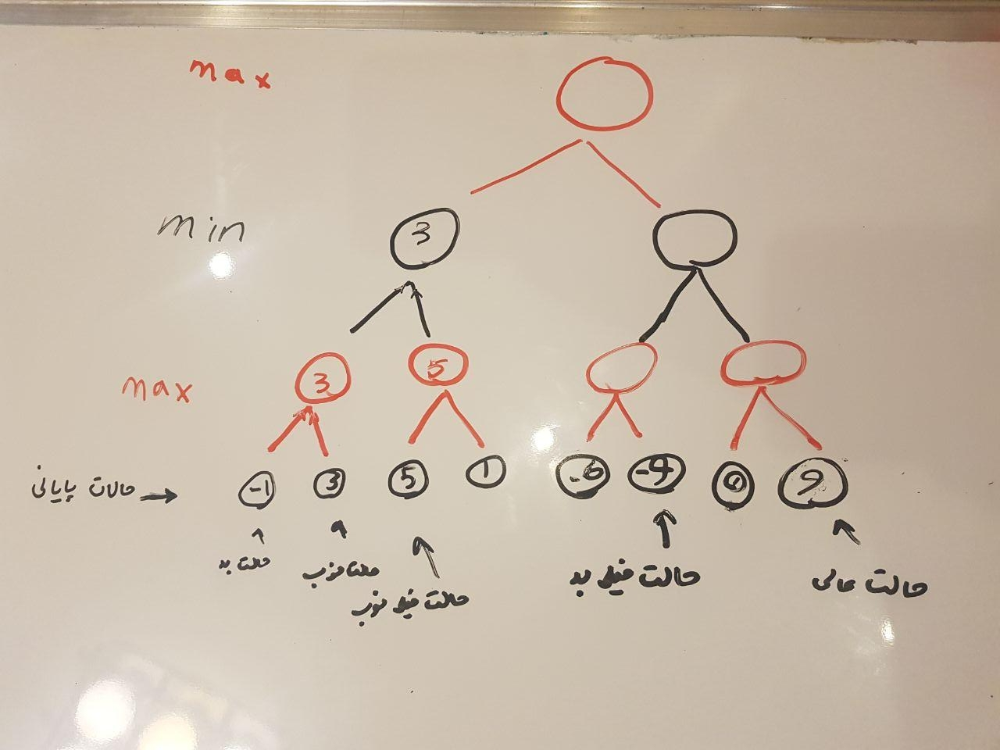

# session 3: Min-max Algorithm
+ min-max
+ minimax
+ saddle point (نقطه زینی)


### review: tuple and enumerate 
+ tuple: immutable list!
+ enumerate: use for-each and still access to indix


### review: recursion

+ review fib: fib(n) use fib(n-1) and fib(n-2)
+ solve smaller problem(s) in order to solve big problem 
+ base case: we already know the answer for the small problem
+ more: [wikipedia](https://en.wikipedia.org/wiki/Recursion_(computer_science))


### intro: backtracking
+ not related to Kali Linux and hack stuff
+ some kind of algorithm
+ explore all possible situations
+ not optimal, but still could be useful
+ use recursion (in DFS order)
+ for example 
    1. explore all combinations to solve a Sudoko
    2. N-queen 
    3. maze solving 
    4. finding all sub-sets
+ more: [backtracking](https://en.wikipedia.org/wiki/Backtracking)


### review: two-player game(!)
+ chess for instance
+ each player try to win
+ they **do best to win** -> play optimum
+ red turn, black turn, red turn, black turn
+ each turn, player try to **maximize** chance of win (minimize chance of loss!).
+ what is chance of win? in chess we can calculate it.
+ we can use minimax to maximize our chance of win and develop some AI


## minimax

+ AI for two player games
+ originally developed for "zero sum" games.
+ main version good enough for Tic-Tac-Toe (XO)
+ it could be useful for chess, backgammon 
+ try to minimize **maximum loss**
  + try to win although other player play optimum
  + we assume that other players plays really well 
+ we are **maximizer** and opponent is **minimizer**. (maximize and minimize chance of our win.)

+ example 1
  


+ pseudo code


```pascal
function minimax(node, depth, maximizingPlayer) is
    if depth = 0 or node is a terminal node then
        return the heuristic value of node
    if maximizingPlayer then
        value := −∞
        for each child of node do
            value := max(value, minimax(child, depth − 1, FALSE))
        return value
    else (* minimizing player *)
        value := +∞
        for each child of node do
            value := min(value, minimax(child, depth − 1, TRUE))
        return value


(* Initial call *)
minimax(origin, depth, TRUE)
```


+ example 2

and then 
+ run `step1.py`


+ more: [wikipedia](https://en.wikipedia.org/wiki/Minimax)
+ even more: [game theory](https://en.wikipedia.org/wiki/Game_theory) and [nash equilibrium](https://en.wikipedia.org/wiki/Nash_equilibrium)


### Tree?

+ DS? we don't know what is tree yet.
+ ways to finish game.
+ each player make a choice and we move down in tree.


## apply minimax for Tic-Tac-Toe


+ how to calculate base cases? v=?  	
+ we need **evaluation function**
+ check status of a board:

  1. X wins
  2. O wins
  3. Tie
+ assume that we play as X
  +  X wins: +1 (good)
  + O wins: -1 (bad)
  + Tie: 0

let's write it:

```python
def evaluate(b): 
	# Checking Rows. 
	for row in range(0, 3): 
		if b[row][0] == b[row][1] and b[row][1] == b[row][2]: 
			if b[row][0] == 'x': 
				return +1
			elif b[row][0] == 'o': 
				return -1
	# Checking Columns. 
	for col in range(0, 3): 
		if b[0][col] == b[1][col] and b[1][col] == b[2][col]: 
			if b[0][col]=='x': 
				return +1
			elif b[0][col] == 'o': 
				return -1
	# Checking Diagonals. 
	if b[0][0] == b[1][1] and b[1][1] == b[2][2]: 
		if b[0][0] == 'x': 
			return +1
		elif b[0][0] == 'o': 
			return -1
	if b[0][2] == b[1][1] and b[1][1] == b[2][0]: 
		if b[0][2] == 'x': 
			return +1
		elif b[0][2] == 'o': 
			return -1
	# if none of them have won then return 0 
	return 0
	
# Driver code 
if __name__ == "__main__": 
	board = [['x', '_', 'o'], 
			['_', 'x', 'o'], 
			['_', '_', 'x']] 
	value = evaluate(board) 
	print("The value of this board is", value) 
# source: https://www.geeksforgeeks.org/minimax-algorithm-in-game-theory-set-2-evaluation-function
```

+ run `./step2.py`


## complete Tic Tac Toe without Minimax
+ `create_board` method
+ clear screen method 
+ while in main 
+ `valid_moved` and `set_move`

+ run `./step3.py`


## Tic Tac Toe with Minimax

+ how to handle board copies?
+ what is depth in this game?
+ 

+ run `./step3.py`
+ 
